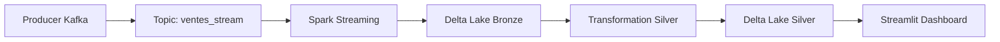

# 📊 Streaming Pipeline de Ventes avec Kafka, Spark & Delta Lake

Un pipeline complet de données en temps réel pour traiter et visualiser des ventes e-commerce. Ce projet démontre l'architecture Lambda avec ingestion Kafka, traitement Spark Streaming, stockage Delta Lake et dashboard Streamlit.


## 🎯 Vue d'ensemble

Ce projet implémente une architecture de données moderne en trois couches :

- **Bronze Layer** : Données brutes ingérées depuis Kafka
- **Silver Layer** : Données nettoyées et agrégées
- **Gold Layer** : Dashboard interactif pour l'analyse business

```
Kafka Producer → Spark Streaming → Delta Lake (Bronze) → Transformation → Delta Lake (Silver) → Streamlit Dashboard
```

## ✨ Fonctionnalités

- ⚡ Ingestion de données en temps réel via Kafka
- 🔄 Traitement streaming avec Spark Structured Streaming
- 💾 Stockage ACID-compliant avec Delta Lake
- 📊 Dashboard interactif avec métriques clés
- 🎨 Visualisations dynamiques (Plotly)
- 🌍 Analyse multi-dimensionnelle (clients, produits, pays)

## 🏗️ Architecture



## 📋 Prérequis

- Python 3.8+
- Apache Kafka 2.8+
- Apache Spark 3.x
- Java 8 ou 11

## 🚀 Installation

### 1. Cloner le repository

```bash
git clone https://github.com/votre-username/streaming-ventes-pipeline.git
cd streaming-ventes-pipeline
```

### 2. Créer un environnement virtuel

```bash
python -m venv venv
source venv/bin/activate  # Sur Windows: venv\Scripts\activate
```

### 3. Installer les dépendances

```bash
pip install -r requirements.txt
```

**requirements.txt** :
```txt
kafka-python==2.0.2
pyspark==3.4.0
delta-spark==2.4.0
streamlit==1.28.0
pandas==2.0.3
plotly==5.17.0
deltalake==0.12.0
```

### 4. Installer et démarrer Kafka

**Sur Linux/Mac** :
```bash
# Télécharger Kafka
wget https://downloads.apache.org/kafka/3.6.0/kafka_2.13-3.6.0.tgz
tar -xzf kafka_2.13-3.6.0.tgz
cd kafka_2.13-3.6.0

# Démarrer Zookeeper
bin/zookeeper-server-start.sh config/zookeeper.properties &

# Démarrer Kafka
bin/kafka-server-start.sh config/server.properties &
```

**Sur Windows** :
```cmd
# Utiliser les scripts .bat dans le dossier bin\windows\
bin\windows\zookeeper-server-start.bat config\zookeeper.properties
bin\windows\kafka-server-start.bat config\server.properties
```

### 5. Créer le topic Kafka

```bash
bin/kafka-topics.sh --create \
  --topic ventes_stream \
  --bootstrap-server localhost:9092 \
  --partitions 3 \
  --replication-factor 1
```

## 🎮 Utilisation

### Étape 1 : Démarrer le producteur Kafka

```bash
python producer_ventes.py
```

Le producteur génère des ventes aléatoires toutes les 2 secondes avec :
- 5 produits différents (électronique, livres)
- 3 clients types (France, Espagne, UK)
- Segments : Particulier / Entreprise

### Étape 2 : Lancer le streaming Spark (Bronze Layer)

```bash
python spark_streaming_delta.py
```

Ce script :
- Lit les messages depuis Kafka
- Parse le JSON
- Enrichit avec des timestamps
- Écrit en Delta Lake avec partitionnement par jour

### Étape 3 : Générer la couche Silver (Agrégations)

```bash
python streaming_silver.py
```

Crée des agrégations par client :
- Total des dépenses
- Nombre d'achats
- Panier moyen
- Indicateur de fidélité

### Étape 4 : Visualiser avec Streamlit

```bash
streamlit run dashboard.py
```

Le dashboard affiche :
- 💰 Chiffre d'affaires total
- 📦 Volume de ventes
- 🛒 Panier moyen
- 🏆 Top client
- 📊 Graphiques interactifs

## 📁 Structure du projet

```
streaming-ventes-pipeline/
│
├── producer_ventes.py          # Générateur de données Kafka
├── spark_streaming_delta.py    # Pipeline streaming Bronze
├── streaming_silver.py         # Transformation Silver
├── dashboard.py                # Dashboard Streamlit
│
├── delta_ventes_table/         # Données Bronze (généré)
├── delta_silver_aggreges/      # Données Silver (généré)
├── checkpoint_ventes/          # Checkpoints Spark (généré)
│
├── requirements.txt            # Dépendances Python
└── README.md                   # Ce fichier
```

## 🔧 Configuration

### Variables importantes

**producer_ventes.py** :
```python
KAFKA_TOPIC = "ventes_stream"
KAFKA_SERVER = "localhost:9092"
```

**spark_streaming_delta.py** :
```python
.option("kafka.bootstrap.servers", "localhost:9092")
.option("subscribe", "ventes_stream")
```

**dashboard.py** :
```python
SILVER_PATH = "delta_silver_aggreges"
```

## 📊 Exemple de données

### Message Kafka (JSON)
```json
{
  "vente_id": 42,
  "client_id": 1,
  "produit_id": 101,
  "timestamp": "2024-12-16T14:30:00",
  "quantite": 2,
  "montant": 1799.98,
  "client_nom": "Jean Dupont",
  "produit_nom": "Ordinateur portable",
  "categorie": "Électronique",
  "pays": "France",
  "segment": "Particulier"
}
```

### Table Silver (Agrégée)
| client_id | client_nom | pays | total_depense | nb_achats | panier_moyen |
|-----------|------------|------|---------------|-----------|--------------|
| 1 | Jean Dupont | France | 2549.97 | 12 | 212.50 |
| 3 | John Smith | UK | 1899.50 | 8 | 237.44 |

## 🐛 Troubleshooting

### Problème : "Module 'delta' not found"
```bash
pip install delta-spark==2.4.0
```

### Problème : Kafka ne démarre pas
Vérifiez que le port 9092 est libre :
```bash
netstat -an | grep 9092
```

### Problème : "delta_ventes_table not found"
Assurez-vous d'avoir lancé `spark_streaming_delta.py` et qu'il ait reçu au moins un message.

### Problème : Encodage UTF-8 sur Windows
Ajoutez en haut des scripts :
```python
# -*- coding: utf-8 -*-
```

## 🚀 Améliorations possibles

- [ ] Ajouter un monitoring avec Prometheus/Grafana
- [ ] Implémenter des alertes sur seuils (anomalies)
- [ ] Créer une API REST pour exposer les métriques
- [ ] Ajouter des tests unitaires (pytest)
- [ ] Containeriser avec Docker Compose
- [ ] Implémenter du Machine Learning (prédiction de churn)
- [ ] Ajouter une authentification au dashboard

## 📚 Ressources

- [Documentation Kafka](https://kafka.apache.org/documentation/)
- [Spark Structured Streaming Guide](https://spark.apache.org/docs/latest/structured-streaming-programming-guide.html)
- [Delta Lake Documentation](https://docs.delta.io/)
- [Streamlit Docs](https://docs.streamlit.io/)

## 🤝 Contribution

Les contributions sont les bienvenues ! N'hésitez pas à :

1. Fork le projet
2. Créer une branche (`git checkout -b feature/amelioration`)
3. Commit vos changements (`git commit -m 'Ajout fonctionnalité'`)
4. Push vers la branche (`git push origin feature/amelioration`)
5. Ouvrir une Pull Request

## 📝 Licence

Ce projet est sous licence MIT. Voir le fichier `LICENSE` pour plus de détails.

## 👨‍💻 Auteur

**Votre Nom**
- GitHub: [@votre-username](https://github.com/votre-username)
- LinkedIn: [Votre Profil](https://linkedin.com/in/votre-profil)

---

⭐ N'oubliez pas de mettre une étoile si ce projet vous a été utile !
